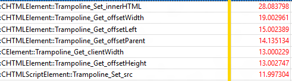

# Analyzing a Trace

## Open Windows Performance Analyzer (WPA)
Open Windows Performance Analyzer (WPA) then open the ETL file to be analyzed using File/Open.

## Load Symbols and Apply HTML Analysis Profile
#### WARNING: Loading symbols will require a large download and will take a significant amount of time on a typicaly internet connection.
Immediately Load Symbols by choosing Trace/Load Symbols from the menu. The symbols will be cached to disk and future traces will be load symbols much faster. After symbols begin loading, apply the Html Analysis Profile by selecting Profiles/Apply from the menu then clicking Browse Catalog. Choose HtmlResponsivenessAnalysis.wpaProfile and the profile will load a number of graphs and tables to allow analysis to begin.

## Zoom to remove Trace rundown
One important tip is to remove the Trace Rundown section by zooming in on the remaining section. This can be done by left clicking, holding and selecting the region to be zoomed. Then right click and choose Zoom. This will affect all graphs and charts on the active tab.

## The Html Responsiveness Analysis Profile creates 4 tabs:
**Big Picture** - This is really valuable to confirm there are no unexpected sources of CPU activity and the browser indeed is using all available resources. Check CPU usage and confirm that no processes contribute significantly to CPU usage other than the browser.

**Frame Analysis** - This is the most used section for basic analysis. CPU Usage (Attributed) HTML UI Thread CPU Breakdown should show you detailed browser (Microsoft Edge) CPU usage attributed to a specific subsystem.

**Thread Delay Analysis** - Typically used by Microsoft Edge developers to investigate when one thread is blocked and waiting on another. Rarely useful to web developers.

**Trace Markers** - This section would show all tracing markers coming from browser (Microsoft Edge) as well as  msWriteProfilerMark giving very precise points to measure code. To see msWriteProfilerMark tracing, go to Generic Events section and select HTML msWriteProfilerMark from the drop-down.

## In Frame Analysis, investigate what is using the CPU
In the Frame Analysis tab, the CPU Usage (Sampled) table is where most analysis is conducted. By expanding the various processes, the JavaScript and browser code that is taking the most CPU can be identified. It is very common that a single bit of JavaScript is responsible for a performance issue and a bit of work to optimize it can make a significant difference.

## Trick for bottom's up DOM call analysis
Start by looking at CPU Usage (Sampled) Breakdown by Process, Thread, Activity, Stack. Click on any cell in Stack column. Press Ctrl+F and search for "ExternalFunctionThunk". (NOTE: This only works if you have successfully loaded symbols!)

After finding any line with ExternalFunctionThunk (for context this is interface from the JavaScript engine, Chakra, to the Microsoft Edge engine. It shows where code bridges to browser from JavaScript execution. Right-click on it and select View Callees/By module. This gives a list of top browser engine functions with weights (in milliseconds).

To find the JavaScript calling that API, right click on it and select View Callers/By function then expand the tree to find the JavaScript responsible by weight.
