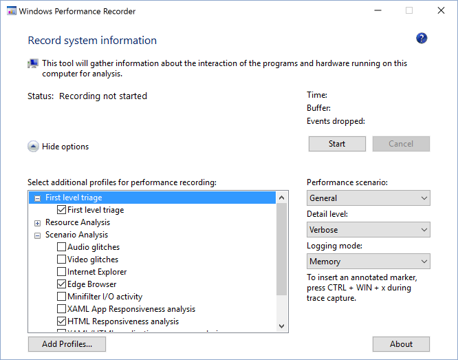

# Recording a Trace

## 1. Prepare computer to gather a performance trace
Shut down as many running programs as possible to avoid noise in the trace that is going to be recorded. Ideally, the only running software will be Windows Performance Recorder (WPR) and the browser.

## 2. Launch Windows Performance Recorder (WPR) and select options
Launch WPR and ensure the More options is expanded. Check the Edge Browser and HTML Responsiveness analysis boxes.

#### Tips and Tricks for Gathering Traces
- Run WPR at least once and try to gather a trace - WPR might show you required further settings you would need to enable on this machine (like Disabling a Paging Executive)
- Please try to keep background activity to an absolutely required minimum - background processes may skew both perceived performance and actual performance characteristics and affect the results - ideally you don't have any running applications beside browser and WPR.
- Identify scenario you're analyzing and try to keep this as atomic as possible. Imagine you have a performance problem when you load the page, scroll it down and select something in the table. Those would be three individual scenarios:
  - Page load (from start of navigation to page load complete)
  - Scroll
  - Selecting something in the table
- If the scenario involves navigating to a site, begin the scenario at about:blank. If it involves navigating away from a site, navigate to about:blank to complete the scenario. This will keep the noise of other sites out of the trace unless the specific interaction between sites is the issue under investigation.

## 3. Record the scenario
Click Start to begin recording. You will observe that the tool will report the size of the buffer it is using which can be helpful to understand how large the file generated will be. Execute the scenario that is being measured then click Stop and immediately Save the trace. Saving immediately after stopping will help keep the trace file small.

#### After Saving

## 4. Analyze the trace
Now that a trace has been collected, the next step is analyze it to see if there are optimizations that can be made. To get started, go [Analyze the trace](../analyzing-a-trace)
